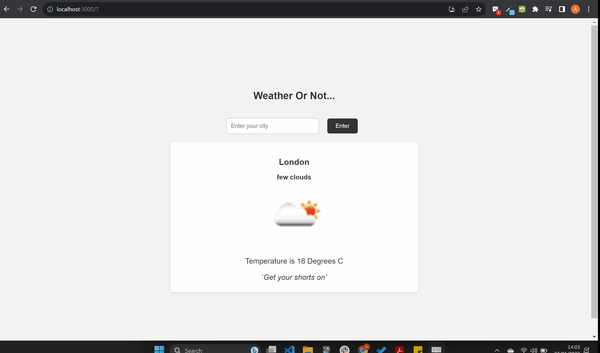

# Hackathon #11 - Recipe Keeper App

###### May 2023

A weather app that allows you to check the weather by city name.

## Screenshots

## Motivation

For this hackathon we were tasked with building a weather checker app using TypeScript and React that pulled data from https://openweathermap.org/api. At this point it has been a few weeks since we had used React and only our second day using TypeScript and React after a brief introduction the previous day.

## Lessons Learned

Main lessons learned:

- How to describe the data you choose to receive from the API in an alias
- How to pass props in TypeScript, including functions
- Ignore the red line errors when working on your code and finish what it is you are doing

## Tech Stack

**Client:** TypeScript, React, CSS

## Installation and Setup Instructions

You will need `node` and `npm` installed on your machine.

Clone the repo:

`https://github.com/anjiqbal/weather-app`

Install the required npm modules:

`npm install`

Start the application:

`npm start`

## Improvements

Potential future improvements:

- Update the weather information to include more detail that may be relevant to the user
- Allow the user to store cities that they wish to have quick access to
- Add a dark mode

## Usage

1. Input the city you wish to see the weather for and press the 'Enter' button on your keyboard or press the 'Enter' button on the user interface.
